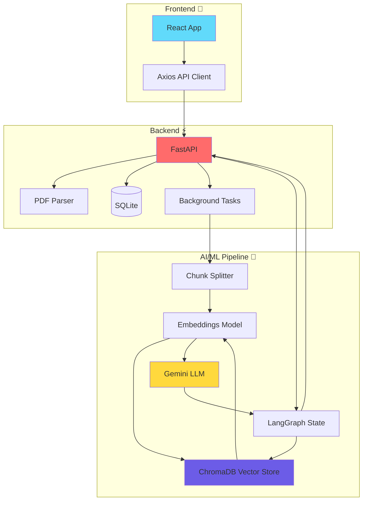
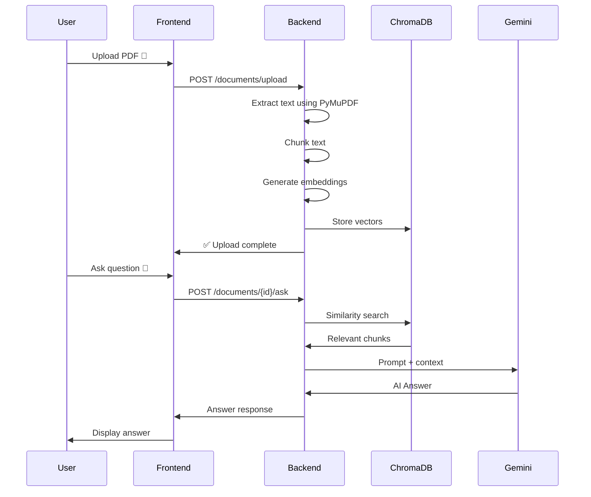

# 📄 PDF Q&A Chatbot 🤖

A full-stack AI-powered application that lets you 📤 **upload PDFs** and ask questions about their content. Built with **LangChain**, **Gemini**, **FastAPI**, **React**, and **ChromaDB**.

---

## ✨ Features

| Feature | Description |
|---------|-------------|
| 📤 **PDF Upload** | Drag & drop your PDF documents |
| 🔍 **Text Extraction** | Automatic text parsing from PDFs |
| 🗂️ **Vector Indexing** | Semantic search with ChromaDB |
| 💬 **Conversational Q&A** | Chat with your documents contextually |
| 🎨 **Modern UI** | Beautiful React + Tailwind + Framer Motion |

---

## 🏗️ Architecture



---

## 🔄 How It Works



---

## 🛠️ Tech Stack

### Backend 🐍
<div align="center">

| Tech | Purpose |
|------|---------|
| **FastAPI** | High-performance API framework |
| **LangChain** | LLM orchestration |
| **LangGraph** | Stateful conversation management |
| **Gemini Pro** | Language model |
| **ChromaDB** | Vector database |
| **PyMuPDF** | PDF parsing |
| **SQLAlchemy** | ORM |
| **Uvicorn** | ASGI server |

</div>

### Frontend ⚛️
<div align="center">

| Tech | Purpose |
|------|---------|
| **React** | UI framework |
| **Vite** | Build tool |
| **Tailwind CSS** | Styling |
| **Framer Motion** | Animations |
| **Axios** | HTTP client |

</div>

---

## 📁 Project Structure

```
.
├── 🐍 backend/
│   ├── app/
│   │   ├── 📡 routers/         # API endpoints
│   │   ├── 🧠 services/       # Q&A logic
│   │   ├── 🗂️ models/         # Database models
│   │   ├── 💾 schemas/        # Pydantic schemas
│   │   ├── 🛠️ crud/           # Database operations
│   │   ├── 📄 utils/          # PDF parsing
│   │   └── 💿 vector_store/   # ChromaDB integration
│   ├── 📦 requirements.txt
│   └── ▶️ run.py
│
├── ⚛️ frontend/
│   ├── 🖼️ public/
│   ├── 📁 src/
│   │   ├── 🧩 components/     # React components
│   │   ├── 🌐 services/       # API client
│   │   ├── 📝 App.jsx
│   │   └── 🎨 index.css       # Tailwind v4
│   ├── 📦 package.json
│   └── ⚡ vite.config.js
│
└── 📖 README.md
```

---

## 🚀 Getting Started

### Prerequisites
- 🐍 Python 3.11+
- ⚛️ Node.js 16+
- 🔑 Google Gemini API Key

### Backend Setup

```bash
# Navigate to backend
cd backend

# Create virtual environment
uv venv
source .venv/bin/activate  # Linux/Mac
# .venv\Scripts\activate   # Windows

# Install dependencies
uv pip install -r requirements.txt

# Create .env file
echo 'DATABASE_URL="sqlite:///./pdf_qna_app.db"' > .env
echo 'GOOGLE_API_KEY="your-api-key"' >> .env

# Run server
python run.py
```

### Frontend Setup

```bash
# Navigate to frontend
cd frontend

# Install dependencies
npm install

# Create .env file
echo 'VITE_API_BASE_URL=http://localhost:8000/api/v1' > .env

# Start development server
npm run dev
```

---

## 📡 API Endpoints

| Method | Endpoint | Description |
|--------|----------|-------------|
| 📤 POST | `/api/v1/documents/upload` | Upload PDF |
| 📋 GET | `/api/v1/documents/` | List documents |
| 🔎 GET | `/api/v1/documents/{id}` | Get document |
| 💬 POST | `/api/v1/documents/{id}/ask` | Ask question |

**API Docs:** http://localhost:8000/docs

---

## 🌐 Deployment Options

| Platform | Cost | Notes |
|----------|------|-------|
| **Railway** | $5/mo | Best DX, persistent storage |
| **Render** | $7/mo | Stable, good uptime |
| **Hugging Face** | Free* | CPU only, no persistence |
| **Fly.io** | ~$4/mo | Global latency |

---

## 🗺️ Roadmap

- [ ] 🔐 User authentication
- [ ] 💾 Chat history persistence
- [ ] 📄 Support .docx, .txt
- [ ] 🌊 Streaming responses
- [ ] 🗑️ Document management
- [ ] 🎯 Model selection UI

---

## 📜 License

MIT License - feel free to use this project!

---

<div align="center">

Made with ❤️ using LangChain + Gemini + FastAPI + React

</div>